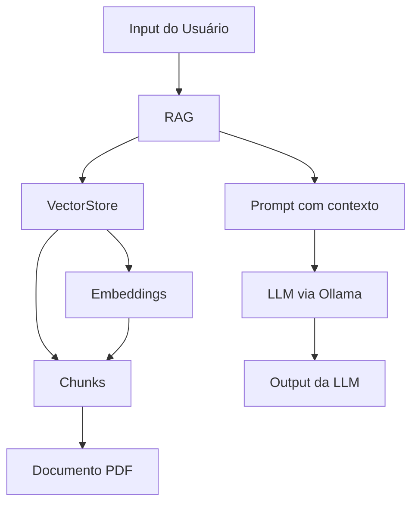

# 🤖 Retrieval-Augmented Generation :arrows_clockwise:
Aplicação que utiliza o RAG para tornar as respostas da LLM mais precisas com base em um contexto

[]()
[]()
[]()
[]()
[]()
[]()
---

## :beginner: Tecnologias utilizadas:
- **Python**
- **Ollama**
- **Docker**
- **Chroma**
- **nomic-embed-text**

## :pencil: Explicação
Com este repositório você poderá entender um pouco melhor de como a técnica RAG funciona e como pode ser benéfica para seus projetos de IA. Se já tem alguma noção de como o RAG funciona e deseja ir direto ao como o código funciona, sugiro que pule para próxim estapa.

### ***RAG - RETRIEVAL-AUGMENTED GENERATION:***
> É uma tecnica utilizada para melhorar a precisão das respostas das LLMs, diminuindo assim alucinações e imprecisões.

1. Por meio do **Input** de entrada do usuário, transformamos esse input do tipo String em **Vetores** para que haja maior eficiência na busca de informações semelhantes.
2. Após fazemos uma consulta com um **VectorSearch** em um banco de dados vetorial que está com informações pré-armazenadas de um **Document-Retrieval** (contém informações sobre algum contexto específico que possa desejar que a LLM saiba para responder com maior precisão, como por exemplo: informações pessoais, dados que não estavam contidos no treinamento ou informações muito específicas), esse documento foi separado em **Chunks** e cada um de seus Chunks foi transformado em vetores, assim conseguimos particionar a busca pelas informações e tornamos a pesquisa algo mais rápido e preciso.
3. Depois que da busca no banco de dados são retornados valores que são semelhantes ao input do usuário, assim comparamos os vetores semelhantes, como sabemos quais são os vetores associados às palavras separadas em Chunks, podemos recuperar essas informações e repassar os resultados semelhantes para a LLM por meio de um **Prompt** com o contexto contido.
4. Então criamos um prompt e enviamos este para a LLM formular um **Output** ao usuário.
### ***FUNCIONAMENTO:***
Com base no seguinte fluxo entenderemos melhor como o processo do RAG funciona:

- **Input do usuário:** é realizado um input e entramos no RAG.
- **RAG:** no RAG entramos no VectorStore e então no Embeddings para transformar a pergunta em Vetores.
- **VectorStore:* utiliza um VectorSearch para pesquisar dentro das informações armazenadas quais são os vetores mais semelhantes aos do Input.
- **Embeddings:** tem a função de transformar os Chunks em vetores e armazenar estar informações no banco de dados
- **Chunks:** tem a função de separar o Documento PDF em Chunks, ou pedaços menores.
- Prompt com contexto: após terem sido retornado vetores associados ao input criamos um prompt com o contexto das informações e repassamos para a LLM.
- **LLM via Ollama:** a LLM recebe o prompt e com base nele ela responde ao Input inicial do Usuário
- **Output da LLM:** resposta totalmente baseada no Document-Retrieval, ofercendo maior precisão ao contexto do usuário.
- 
## :rocket: Explicação do Código:
Com o fluxo do código abaixo:
```
RagApp
  └──App
  │   ├──chunks.py
  │   ├──embed.py
  │   ├──extractor.py
  │   ├──ollamaLLM.py
  │   ├──ragApp.py
  │   └──vectorStore.py
  └──ChromaDB
  └──Files
  └──.env
  └──docker-compose.yml
  └──requirements.txt
```
### App:
- chunks.py: Responsável por separar o documento de texto extraido do PDF pela função ***extractor.py*** em chunks, ou seja, pedaços menores, com o método ***split_data***. Foi configurado um Chunk Size de 100 caracteres e Overlap de 30 (sobreposição que garante que o contexto de um chunk não seja afetado)
- embed.py: Utilizando o criador de embeds ***nomic***, iremos recuperar o texto separado em chunks de ***chunks.py*** e transformaremos cada um destes chunks em vetores  com o método ***embed_text***. O método ***embed_query*** é acionado quando queremos transformar o input em vetores. OBS: Este código está processando os embbedings a partir de uma API pelo Atlas NOMIC AI (Encontrar na documentação), porém no código tem a implementação local para caso queira usar a placa de vídeo ou cpu para processar os embeddings.
- extractor.py: Extrai o texto do PDF armazenado na pasta ***Files*** em texto com o método ***extract_text***.
- ollamaLLM.py: Em um loop de conversa com a LLM, fornecemos o ***Input*** inicial e a ***Persona*** que a LLM deverá seguir, utilizamos o método ***compair_vector*** armazenado em ***ragApp.py*** para iniciar o fluxo de criação do prompt para a LLM. Aqui você encontrará os parâmetros informados para que a comunicação da LLM rodando localmente funcione, nesse exemplo utilizamos o modelo do ollama ***gemma3:1b***.
- ragApp.py: Aqui são realizados os processos de pegar o input fornecido pelo usuário e então transformá-lo em vetor e retornar o resultado que o ***VectorSearch*** encontrou de vetores mais próximos para formular o prompt, utilizando o método ***compair_vector***
- vectorStore.py: Gerencamento do banco de dados vetorial com os métodos de ***verificação/criação (collection_verify_create)***, ***adição de dados ao banco (collection_add)*** e ***consulta com o VectorSearch trazendo os 3 resultados mais semelhantes (collection_query)***.
### ChromaDB:
- Arquivo necessário para que o ***vectorStore.py*** saiba onde armazenar o banco de dados, local onde serão armazenados os dados que serão criados com base no documento fornecido.
### Files:
- Arquivo necessário para que o ***extractor.py*** saiba de onde pegar o PDF e transcrever as informações, nele deve ser armazenado o PDF que será utilizado no RAG.
### .env:
- Arquivo com informações necessário para que o container docker do ollama funcione.
### docker-compose.yml:
- Arquivo que contém o container configurado no modelo de LLM do ollama ***gemma3:1b(modelo utilizado no código)***, porém este pode ser alterado à preferência do usuário.
### requirements.txt:
- Documento com todas as bibliotecas utilizadas no código, para adicioná-las com facilidade dê o comando ***(pip install -r requirements.txt)***.

## :computer: Implementação Prática:
Para implementar o código e realizar seus testes localmente, clone o repositório em um pasta com:
```
git clone https://github.com/RyanBrittes/RagApplication.git
```
Inicialize o ollama no container indo à pasta clonada do repositório pelo bash e dando o comando:
```
docker compose up -d
ou
docker-compose up -d
(dependendo da sua versão do docker)
```
Com o ollama funcionando, entre na pasta App do código e dê start no arquivo ***ollamaLLM.py***, se estiver no bash:
```
python ollamaLLM.py
```
## Documentação adicional:
Caso queira encontrar uma documentação adicional das tecnologias utilizadas, seguem os arquivos:
| Tecnologia | Doc   |
|---------------|----------------|
| Ollama   | [gemma3:1b](https://ollama.com/library/gemma3)   |
| Chroma | [Repositório](https://github.com/chroma-core/chroma?tab=readme-ov-file)    |
| Chroma | [Site](https://docs.trychroma.com/docs/overview/introduction) |
| Nomic  |  [Repositório](https://github.com/nomic-ai)  |
| Nomic  |  [Site](https://docs.nomic.ai/reference/api/embed-text-v-1-embedding-text-post)  |
| Nomic  |  [Site](https://docs.nomic.ai/atlas/embeddings-and-retrieval/text-embedding)  |

## Considerações finais:
Estou disponível para caso hajam dúvidas ou dicas de melhorias, abaixo encontre os meios de contato comigo:
[](https://www.linkedin.com/in/ryanbrittes/)
